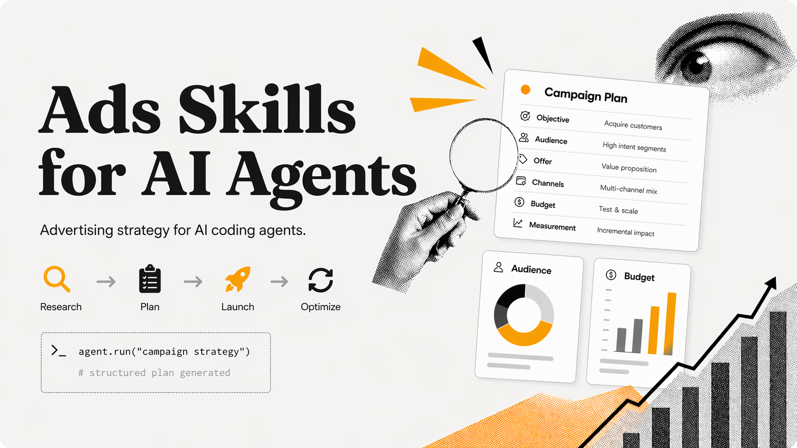

# Ads Skills for AI Agents

These skills teach your agent how to run ads. They cover advertising strategy for both Meta and Google (and soon LinkedIn, TikTok, X, and Reddit).

<p align="center">
  
</p>

Install once, and your agent plans campaigns using real frameworks instead of hallucinating settings.

```bash
npx skills add adkit-so/ads-skills --all -y -g
```

Works with Claude Code, Cursor, Copilot, Windsurf, OpenAI Codex, and any agent that support skills.

## What changes

|                    | ❌ Without Ads Skills        | ✅ With Ads Skills                                                     |
| ------------------ | ---------------------------- | ---------------------------------------------------------------------- |
| Campaign structure | Agent hallucinates structure | Agent follows proven frameworks                                        |
| Budget             | Agent sets random amounts    | Agent follow a structure that won't nuke your accounts or waste budget |
| Creative           | Agent writes generic copy    | Agent crafts hooks that compete with entertainment, not other ads      |
| Analysis           | Agent reads numbers          | Agent diagnoses issues and recommends specific fixes                   |

## Skills

### Strategy skills

Each covers a single platform end-to-end: campaign structure, audience targeting, creative strategy, budget management, and performance analysis.

| Skill                                                | Platform             | Description                                                                                                  |
| ---------------------------------------------------- | -------------------- | ------------------------------------------------------------------------------------------------------------ |
| [meta-ads-strategy](./skills/meta-ads-strategy/)     | Facebook & Instagram | Auction mechanics, Setup, creative formats, targeting, ROAS tracking. Includes a built-in ad brief workflow. |
| [google-ads-strategy](./skills/google-ads-strategy/) | Google Search        | Keyword mining, account structure, ad copy, negative keyword architecture, Quality Score.                    |

## How it works

1. **Install the skills** — one command, all skills load into your agent
2. **Your agent reads the brief** — Skills includes a built-in brief workflow (product, audience, market, KPIs so it understands the campaign you want to run)
3. **Your agent plans the campaign** — following the platform-specific strategy skill
4. **BONUS: Your agent launch everything for you** — connect [AdKit](https://adkit.so) to let your agent creates and publishes campaigns directly (100% optional, works just fine without, the agent will guide you!)

```
Brief (built into strategy skills)
    |
    v
Strategy skill (meta / google / linkedin / ...)
    |
    v
AdKit skill (optional — create + publish via MCP or CLI)
```

## What's inside

Each strategy skill covers the full campaign lifecycle:

- **Platform mechanics**: how the auction/algorithm works and how to work with it
- **Campaign structure**: hierarchy, objective selection, optimization events
- **Audience targeting**: broad vs. interest-based vs. lookalike, when to use each
- **Budget management**: starting budgets, scaling rules, kill criteria
- **Ad creative**: hook frameworks, format selection (static vs. video vs. carousel), platform-specific specs
- **Ad copy**: headline formulas, description frameworks, CTA patterns
- **Performance diagnostics**: symptom → cause → action framework for reading metrics
- **Account setup**: compliance rules, pixel/tag configuration, ban prevention

## FAQ

**What agents are supported?**
Any agent that supports skills: Claude Code, Cursor, Copilot, Windsurf, OpenAI Codex, and 17+ others.

**Do I need AdKit to use these skills?**
No. The skills work standalone for strategy and planning. AdKit is only needed if you want your agent to create and publish campaigns without logging into Ads Manager.

## Author

Hi! I'm [Nico](https://jeannen.com?src=adkit-skills) ([@nico_jeannen](https://x.com/nico_jeannen)). I've been in digital advertising for almost 10 years, and managed over \$1M+ in ad spend.

I built and sold three apps ($290k combined), two of them grown primarily through paid acquisition. Now building [AdKit](https://adkit.so), the advertising toolbox for SaaS founders and their agents.

## License

Free to use. Redistribution requires written agreement. Usage by competing products strictly forbidden. See [LICENSE](./LICENSE).
